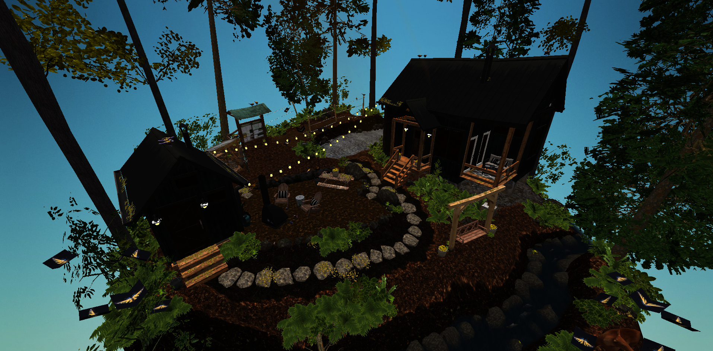
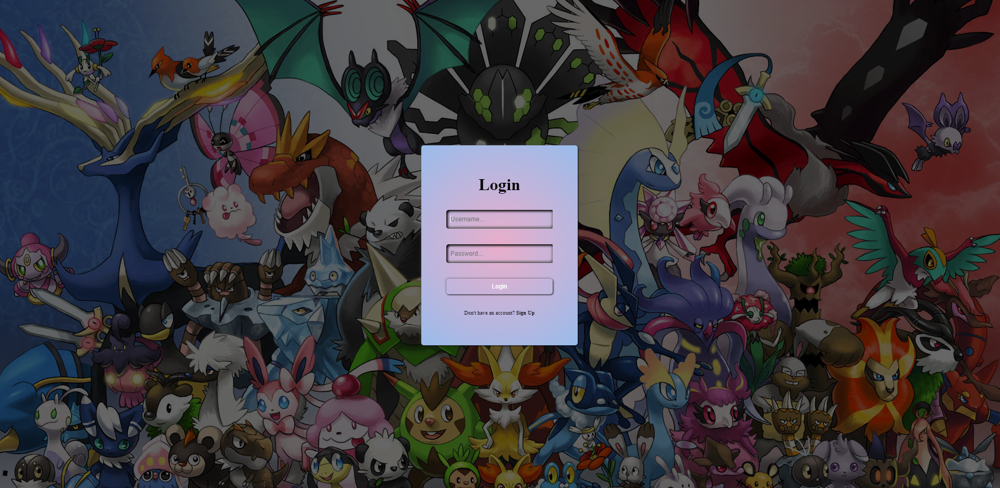
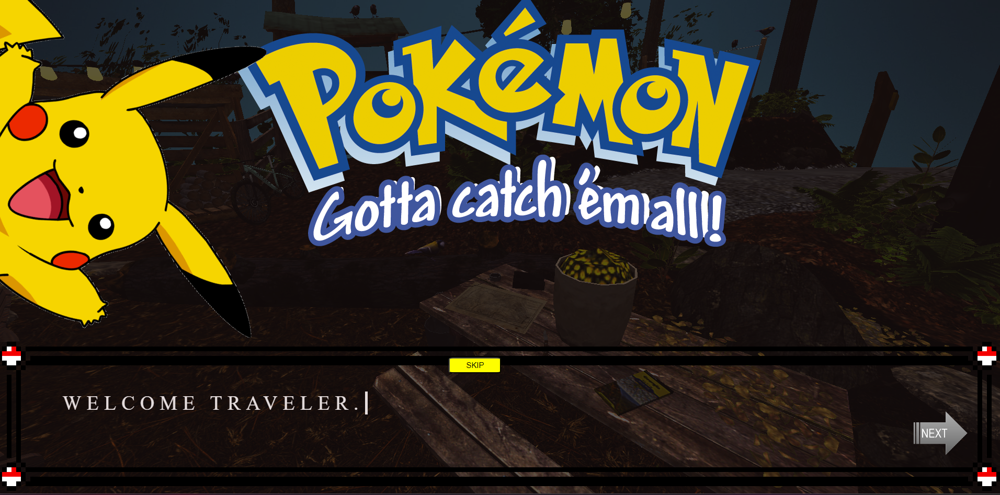

# Gotta fetch 'em all!


## Project Description

### Application Utilities
Our application revolves around a Pokémon game, where you can explore a 3D model of a sky island. By navigating to specific locations, various actions become available, such as purchasing Pokémon or selecting your Pokémon for battles. The map includes diverse locations, each inhabited by a wide variety of untamed Pokémon waiting to be captured. Embark on this adventure, win prizes, and expand your Pokémon army!



Also, we have built a login and sign-in system so that your progress can be safe, allowing you to continuously enjoy a wonderful experience!



Right after you complete the form, you are welcomed by Pikachu, who will take you on a brief tour of the game!! Please be nice to him :))



### Technologies
For this project, I used React with JavaScript for the frontend and Express for the server side. I used Bootstrap and CSS for styling. I recently learned to use these technologies, and I have developed a strong liking for them.


### Upcoming Features
The first thing is to add gravity and collision with the map for a better gameplay experience. Also, adding special powers in fights and feeding your Pokémon so they can evolve are on our agenda. Refactoring is also not out of our sight, so we need to implement React Routing and slowly transition from vanilla CSS to Tailwind.

# INITIALIZE THE PROJECT !
  * ENTER in  ```bash /frontend/public``` and you have there the lobby zipp. you need to unzipp it in the public folder for the project to work!

  * now in your coding program you have to install the dependencies : 
   - open the terminal and enter ```bash ./frontend``` after that write ```bash npm i``` or if you have pnpm ```bash pnpm i``` 
   - open the terminal and enter ```bash ./server``` after that write ```bash npm i``` or if you have pnpm ```bash pnpm i``` 
### OPEN THE PROJECT ! 

  - in both terminals that are opened introduce the command "npm run dev" to start the server and the web page


 


### HOW TO PLAY !

  - MOVEMENT :  W, A, S, D AND SPACE
  - if you wanna press any buttons you gotta press escape for you cursor to appear and click it
  Locations : 
  - at the table in the center you will find the pokemons that you have, the pokemons that tou bought
  - in front you have a map thing, if you go there you can open the map and search for battles but first you gotta select pokemons from inventory at the table that i mentioned
  right before
  - at the cabin at the right you can go at the stairs and open the pokedex where you can see the pokedex with the pokemons


 # IMPORTANT !!!
  -  if you wanna load more pokemons you need to go in /frontend/src/Components/AllPokenons.jsx and at the line 21 you will see this : 
   
   "useEffect(() => {
        let gatheringPokemons = [];

        for (let i = 1; i <20 (CHANGE THIS NUMBER) ; i++) {     HERE YOU CAN CHANGE THE NUMBERS OF POKEMONS ( MAX 1000, NOT RECOMENDED!!!), FOR A GOOD 
            fetch(`https://pokeapi.co/api/v2/pokemon/${i}`)       EXPERIENCE LOAD 100-500 POKEMONS !!!
                .then(res => res.json())
                .then(res => gatheringPokemons.push(res))
        }

        setTimeout(() => {
            setAllPokemons(gatheringPokemons);
            setLoadig(true)
        }, 1000);
    }, [])"

    - YOU MAY HAVE A PROBLEM WHEN REFRESHING THE PAGE !!! IT WONT RELOAD COMPLETLY WE DONT KNOW WHY, BUY YOU JUST GOTTA CHANGE THE URL 
    FROM " http://localhost:5173" TO " http://localhost:5173/1" AND IF IT DOSENT WORK AGAIN CHANGE THE URL BACK AND SO ON !!!

    ## Credits 
    ### PEOPLE WHO WORKED ON THIS PROJECT 
    Iacob Oliver : https://github.com/IacobOliver
    Bogdan Diaconu : https://github.com/bogdandiaconupv
    Paul Costea : https://github.com/Paaul2121